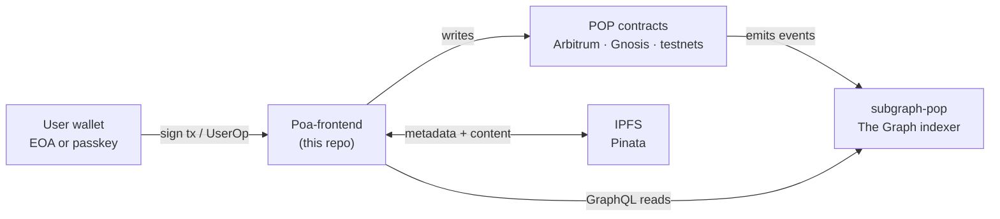

# Poa-frontend

The Next.js app behind [poa.box](https://poa.box). Web interface for [Poa](https://github.com/poa-box), a no-code platform for deploying and running worker- and community-owned organizations on-chain.

[](LICENSE)
[](https://discord.gg/9SD6u4QjTt)
[](https://poa.box)

New to Poa? Read the [org profile](https://github.com/poa-box) first. This README focuses on the engineering surface.

## The Poa stack

This repo is one of four active repositories. They are designed to be worked on together.

| Repo | Role |
| --- | --- |
| [POP](https://github.com/poa-box/POP) | Solidity protocol contracts. Foundry, AGPL-3.0, upgradeable beacons. Defines orgs, voting, vouch-based roles, tasks, education, treasury, agent identity. |
| [subgraph-pop](https://github.com/poa-box/subgraph-pop) | The Graph indexer over POP. Powers every list, dashboard, search, and agent query in the ecosystem. |
| **Poa-frontend** *(this repo)* | Next.js 14 web app. Deploys orgs, proposes, votes, claims tasks, manages treasury, no code required. |
| [poa-cli](https://github.com/poa-box/poa-cli) | Terminal-native interface to everything POP can do, plus an autonomous-agent framework (ERC-8004 identity, libp2p + Automerge CRDT brain files). |

A frontend contributor will often touch all three repos in a single feature. The cross-repo flow is documented in [CONTRIBUTING.md](CONTRIBUTING.md#cross-repo-flow).

## Architecture at a glance



The frontend writes to POP and reads from subgraph-pop. Content that doesn't fit on-chain (proposal bodies, education modules, profile data, org logos) lives on IPFS, addressed by CID stored on-chain as `bytes32`.

### Supported chains

`poa-app/src/config/networks.js` is the source of truth. Don't hardcode chain IDs anywhere else.

| Chain | ID | Role | Subgraph |
| --- | --- | --- | --- |
| Arbitrum One | 42161 | Home chain (accounts, passkeys, core infrastructure) | The Graph decentralized gateway |
| Gnosis | 100 | Default org-deployment chain (xDAI) | The Graph decentralized gateway |
| Sepolia | 11155111 | Ethereum testnet | The Graph Studio |
| Base Sepolia | 84532 | OP Stack testnet | The Graph Studio |

A user's account lives on Arbitrum (the home chain). Their organizations live on whichever chain they were deployed to (Gnosis by default).

## The subgraph layer

Every list view, every dashboard, every "what does this org look like right now" query in the app is a GraphQL query against [subgraph-pop](https://github.com/poa-box/subgraph-pop). The contracts emit events; the subgraph indexes them; the frontend reads them. No custom backend.

What subgraph-pop indexes:

- Organizations (metadata, members count, description, logo CID)
- Voting classes, proposals, votes (hybrid voting, direct democracy)
- Roles via [Hats Protocol](https://www.hatsprotocol.org/): issuance, vouches, claims
- Tasks and projects (creation, claims, submissions, approvals, payouts)
- Education modules (creation, completions, payouts)
- Treasury balances, payment events, merkle distributions
- Paymaster funds (gas-sponsorship deposits and usage)
- Passkey accounts (creation events, factory registry)

### How queries are routed

Apollo (`poa-app/src/util/apolloClient.js`) supports multi-chain in two modes:

**Org-scoped queries.** Pass the org's subgraph URL on the operation context. `POContext` (`poa-app/src/context/POContext.js`) resolves the org from `?userDAO=` in the URL, looks up its chain, and exposes `subgraphUrl`. The default Apollo client picks it up automatically:

```js
useQuery(QUERY, { context: { subgraphUrl } });
```

**Cross-chain queries.** For browse pages and discovery flows that hit every supported chain, use `getClient(subgraphUrl)` to grab a per-endpoint Apollo client with its own cache. This is necessary because Apollo's `InMemoryCache` keys on query plus variables but not endpoint, so reusing one client across chains causes cache poisoning.

```js
const client = getClient(targetSubgraphUrl);
useQuery(QUERY, { client });
```

### Quirks worth knowing about

- **Composite IDs.** Subgraph entity IDs are `{contractAddress}-{numericId}`. Contracts want just the numeric part. Use `parseTaskId` / `parseProjectId` / `parseModuleId` from `poa-app/src/services/web3/utils/encoding.js` before calling a contract method. Wrong format = silent revert.
- **18-decimal wei.** Token amounts come back from the subgraph as raw 18-decimal wei strings, including for the org's Participation Token. Format with `formatTokenAmount` / `parseTokenAmount` from `poa-app/src/util/formatToken.js`.
- **CIDv0 + bytes32.** Content references on-chain are `bytes32` derived from CIDv0 (`Qm…`). Use `ipfsCidToBytes32` / `bytes32ToIpfsCid` from the same `encoding.js`. CIDv1 (`bafy…`) will not round-trip.
- **Indexing latency.** The subgraph trails the chain by a few seconds. The frontend uses optimistic-update grace periods (`UserContext` 15s, `TaskBoardContext` 65s) to mask this; don't reduce them without understanding why they exist.

For background on why Poa runs on The Graph, see [`poa-app/posts/TheGraph.md`](poa-app/posts/TheGraph.md) (rendered in-app as a blog post).

## Smart contracts

ABIs for the 20 contracts the frontend talks to live in `poa-app/abi/`. They are kept in sync with [POP](https://github.com/poa-box/POP) by hand: when contract changes ship, the cross-repo path is **POP → subgraph-pop → Poa-frontend ABI bump**.

A small set of singleton infrastructure addresses (`UniversalAccountRegistry`, `Hats`) live in `poa-app/src/config/contracts.js`. Per-org contract addresses (the org's `TaskManager`, voting modules, `ParticipationToken`, etc.) come from the subgraph at runtime, since they are deployed per-org rather than per-chain.

The frontend never calls ethers or viem directly from a component. All contract interaction goes through the service layer in `poa-app/src/services/web3/`:

- `core/`: `ContractFactory`, `TransactionManager` (EOA), `SmartAccountTransactionManager` (ERC-4337), `eip7702/EOA7702TransactionManager` (sponsored EOA).
- `domain/`: `UserService`, `OrganizationService`, `VotingService`, `TaskService`, `EducationService`, `EligibilityService`, `TokenRequestService`, `TreasuryService`, `HatsService`, `PasskeyOnboardingService`.
- `utils/`: `encoding.js` (CID and ID parsing), `chainClients.js` (per-chain viem clients).

Components get the right manager and services for the active auth method via `useWeb3Services()`. `ErrorParser.js` maps 26+ custom selectors to user-facing copy; let it handle contract errors instead of catching and reformatting them in components.

## Auth & transactions

Two auth paths converge into one transaction abstraction:

- **EOA.** RainbowKit + wagmi. Standard injected-wallet flow. Optional EIP-7702 delegation to `0x776ec88A88E86e38d54a985983377f1A2A25ef8b` lets an EOA become ERC-4337-compatible and receive sponsored gas through `PaymasterHub`.
- **Passkey.** WebAuthn discoverable credentials backed by an ERC-4337 smart account. `PasskeyAccountFactory` deploys the account; UserOps go through the [Pimlico](https://pimlico.io) bundler at `https://api.pimlico.io/v2/{chainId}/rpc?apikey={NEXT_PUBLIC_PIMLICO_API_KEY}`. EntryPoint is v0.7 (`0x0000000071727De22E5E9d8BAf0edAc6f37da032`), same address on all chains.

`AuthContext` unifies both. `useWeb3Services()` returns either `TransactionManager` or `SmartAccountTransactionManager` based on which auth is active. Components use `useTransactionWithNotification().executeWithNotification(...)` for the standard pending, success, and error UX.

WebAuthn RP is `poa.box`. Related origins (white-label hosts) include `dao.kublockchain.com`, `poa.earth`, `www.poa.earth`. White-label setup is documented in [`docs/kubi-dao-setup.md`](docs/kubi-dao-setup.md).

## Quick start

```bash
# Node 18.18.0 is pinned via Volta (poa-app/package.json).
cd poa-app
yarn install
yarn dev          # http://localhost:3000
yarn build        # static export to ./out, used by the IPFS deploy
yarn lint
```

No environment variables are required for read-only browsing. `poa-app/src/config/networks.js` ships hardcoded fallbacks for every RPC and subgraph. The only env var you'll need is `NEXT_PUBLIC_PIMLICO_API_KEY`, and only if you want to test passkey auth flows locally. Without it, EOA + RainbowKit still works.

The full set of overridable env vars (all `NEXT_PUBLIC_*`):

| Variable | Purpose |
| --- | --- |
| `NEXT_PUBLIC_ARBITRUM_RPC_URL` / `NEXT_PUBLIC_ARBITRUM_SUBGRAPH_URL` | Override Arbitrum endpoints |
| `NEXT_PUBLIC_GNOSIS_RPC_URL` / `NEXT_PUBLIC_GNOSIS_SUBGRAPH_URL` | Override Gnosis endpoints |
| `NEXT_PUBLIC_SEPOLIA_RPC_URL` / `NEXT_PUBLIC_SEPOLIA_SUBGRAPH_URL` | Override Sepolia endpoints |
| `NEXT_PUBLIC_BASE_SEPOLIA_RPC_URL` / `NEXT_PUBLIC_BASE_SEPOLIA_SUBGRAPH_URL` | Override Base Sepolia endpoints |
| `NEXT_PUBLIC_PIMLICO_API_KEY` | Required for passkey UserOp submission |

## Deployment

Pushes to `main` trigger [`.github/workflows/deploy-ipfs.yml`](.github/workflows/deploy-ipfs.yml):

1. Build the static export (`yarn build`, with `output: 'export'` set in [`poa-app/next.config.mjs`](poa-app/next.config.mjs)).
2. Upload `./out` to Pinata as a directory; capture the resulting CID.
3. Patch the new CID into [`wrangler.toml`](wrangler.toml).
4. `wrangler deploy` ships [`cloudflare-worker/worker.mjs`](cloudflare-worker/worker.mjs), which reverse-proxies `poa.box`, `www.poa.box`, `poa.earth`, and `www.poa.earth` to the Pinata gateway at the new CID.

There is no Vercel, no Netlify, no traditional Node host. The site is fully static-rendered, served from IPFS, fronted by Cloudflare.

## Repo layout

```
.
├── poa-app/                 # The Next.js app
│   ├── abi/                 # 20 contract ABIs (imported as `../../abi/Foo.json`)
│   ├── posts/               # In-app blog content (markdown)
│   ├── public/              # Static assets, fonts, branding
│   ├── scripts/             # Build helpers (sitemap, deployment helpers)
│   ├── src/
│   │   ├── components/      # UI components, organized by feature
│   │   ├── config/          # networks.js, contracts.js, theme
│   │   ├── context/         # 14 React contexts (POContext, AuthContext, …)
│   │   ├── features/        # Feature modules (org deployer, onboarding tour)
│   │   ├── hooks/           # Custom hooks (useWeb3Services, useTx…)
│   │   ├── lib/             # Shared libs (errors/ErrorParser.js)
│   │   ├── pages/           # Next.js routes (thin wrappers)
│   │   ├── services/web3/   # core/ + domain/ + utils/
│   │   ├── styles/          # Global CSS + Chakra theme
│   │   ├── util/            # queries, apolloClient, formatToken, permissions
│   │   └── utils/           # profileUtils.js (don't confuse with util/)
│   └── next.config.mjs      # Static export configuration
├── cloudflare-worker/       # Worker that fronts poa.box / poa.earth
├── docs/                    # Operational docs (white-label setup)
├── .github/workflows/       # CI: deploy-ipfs.yml
├── wrangler.toml            # Cloudflare Worker config (CID is patched in CI)
├── CLAUDE.md                # Internal dev guide tuned for AI assistants
├── CONTRIBUTING.md          # How to contribute (read this if you're sending a PR)
└── LICENSE                  # AGPL-3.0
```

Path alias: `@/*` resolves to `poa-app/src/*` (`poa-app/jsconfig.json`). Use it. ABIs sit outside `src/`, so import them as `../../abi/Foo.json`.

## Where to learn more

- [Org profile](https://github.com/poa-box): the high-level "what is Poa, why does it exist".
- In-app blog under [`poa-app/posts/`](poa-app/posts/): `TheGraph.md`, `perpetualOrganization.md`, `directDemocracy.md`, `hybridVoting.md`, `contributionVoting.md`.
- [`docs/kubi-dao-setup.md`](docs/kubi-dao-setup.md): running the frontend on a custom domain (white-label).
- [`CLAUDE.md`](CLAUDE.md): internal dev guide. LLM-tuned and terse, but the densest map of project gotchas.
- Sister repos: [POP](https://github.com/poa-box/POP), [subgraph-pop](https://github.com/poa-box/subgraph-pop), [poa-cli](https://github.com/poa-box/poa-cli).

## Contributing

Yes, please. Read [`CONTRIBUTING.md`](CONTRIBUTING.md) for setup, conventions, and PR process. For protocol-level discussions, ABI changes, or larger refactors, hop into [Discord](https://discord.gg/9SD6u4QjTt) before coding.

If you ship something useful here, [join the Poa organization on-chain](https://poa.box/home/?org=Poa). You'll earn Participation Tokens and vote on the project that built the project. Poa runs on Poa.

## License

AGPL-3.0. See [`LICENSE`](LICENSE). By submitting a contribution you agree to license it under the same terms.

## Contact

- **App:** [poa.box](https://poa.box)
- **Email:** [hudson@poa.community](mailto:hudson@poa.community)
- **X:** [@PoaPerpetual](https://x.com/PoaPerpetual)
- **Discord:** [discord.gg/9SD6u4QjTt](https://discord.gg/9SD6u4QjTt)
